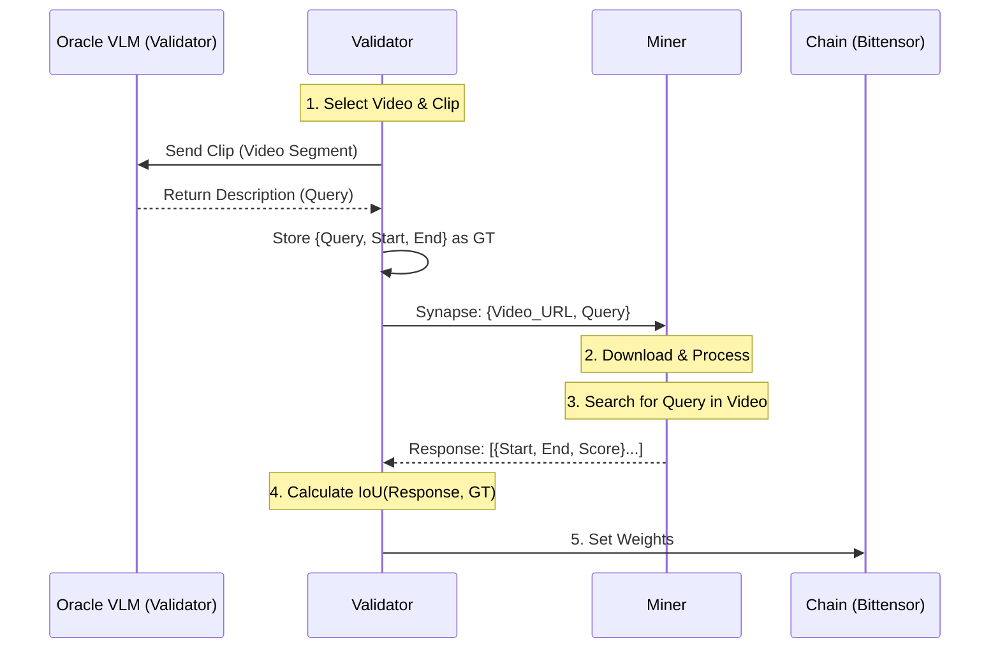

# Design Document: Semantic Video Moment Retrieval (SVMR) Subnet

## 1. Introduction

The SVMR Subnet aims to provide a decentralized service for retrieving specific video moments based on natural language queries. This document outlines the system architecture, including the miner and validator logic, leveraging state-of-the-art (SOTA) research in Temporal Video Grounding (TVG) and Video Moment Retrieval (VMR).

## 2. Core Problem Definition

**Input:**
- Untrimmed Video $V$ (or video features)
- Natural Language Query $Q$

**Output:**
- A set of temporal intervals $\{ (s_i, e_i, score_i) \}$ where $s_i$ is the start time, $e_i$ is the end time, and $score_i$ represents the confidence that the segment matches the query $Q$.

## 3. Overall Subnet Architecture

The subnet operates as a competitive market for semantic video understanding.

### 3.1. High-Level Data Flow

1.  **Task Generation (Validator):** The Validator selects a video and generates a synthetic query (a "Ground Truth" moment) using a secure Oracle VLM.
2.  **Broadcast:** The query (video URL + text description) is sent to all Miners.
3.  **Inference (Miner):** Miners download the video (or features), process it with their models, and return ranked timestamp intervals.
4.  **Scoring (Validator):** The Validator compares the Miner's returned intervals with the Ground Truth interval using IoU (Intersection over Union).
5.  **Weight Setting:** Scores are aggregated over an epoch to set on-chain weights.

### 3.2. Component Interaction Diagram



## 4. Incentive Design

The incentive mechanism is the core driver of the subnet. It must reward **accuracy**, **precision**, and **speed** while punishing hallucination and spam.

### 4.1. Scoring Function

For a single query $q$, a miner returns a list of predicted intervals $P = \{p_1, p_2, ...\}$. The Ground Truth is interval $g$.

The score $S$ for a query is calculated based on the **Intersection over Union (IoU)** of the best matching prediction.

$$ \text{IoU}(p, g) = \frac{\text{intersection}(p, g)}{\text{union}(p, g)} $$

We define a reward function $R$ that prioritizes high-overlap matches:

$$ R(P, g) = \max_{p \in P} \left( \text{IoU}(p, g) \right) $$

**Latency Penalty:**
To encourage real-time performance, we apply a decay factor based on response time $t$:

$$ S_{final} = R(P, g) \times e^{-\lambda t} $$

(Where $\lambda$ is a tunable parameter, e.g., $0.1$ for seconds).

### 4.2. Aggregation & Weights
- Scores are moving averages over the last $N$ queries (e.g., 500).
- **Punishment:** If a miner consistently returns $IoU < 0.1$ (spamming), their weight is set to 0.

## 5. Validator Design

Validators are the "gatekeepers" of quality. They must generate tasks that are **indistinguishable** from organic user queries but have a known ground truth.

### 5.1. Synthetic Task Generation Pipeline (The "Oracle")

Since we cannot rely on human labelers, we use a **Video-Language Model (VLM)** pipeline:

1.  **Video Source:** Maintain a rolling buffer of Creative Commons videos (YouTube, Vimeo) to prevent miners from overfitting on a static dataset.
2.  **Clip Sampling:**
    - Randomly sample a duration $d \in [5s, 60s]$.
    - Randomly sample a start time $t_{start}$.
    - Extract clip $C = V[t_{start} : t_{start} + d]$.
3.  **Caption Generation:**
    - Feed clip $C$ to a VLM (e.g., GPT-4o, Gemini Pro Vision, or open-source LLaVA-Video).
    - Prompt: *"Describe the main action or event in this video clip in one specific sentence. Do not mention visual cuts or camera angles."*
4.  **Relevance Check (Anti-Ambiguity):**
    - The generated caption must *uniquely* identify the clip.
    - Run a lightweight check (e.g., CLIP similarity) against the *rest* of the video. If similarity is too high elsewhere, discard the task (it's too ambiguous).

### 5.2. Organic Traffic Routing
- Validators expose an HTTP API endpoint.
- Organic requests are forwarded to top-performing miners.
- Results are aggregated (e.g., majority vote or weighted average) and returned to the user.

## 6. Miner Design

Miners are free to implement *any* architecture. However, we provide reference implementations to bootstrap the network.

### 6.1. Tier 1: Baseline (CLIP-based Sliding Window)
*Low compute, moderate accuracy.*
1.  **Frame Extraction:** 1 fps.
2.  **Encoding:** CLIP (ViT-L/14) for frames and text.
3.  **Search:** Calculate Cosine Similarity between Query Vector and Frame Vectors.
4.  **Localization:** Apply a threshold (e.g., > 0.25) and merge consecutive frames into intervals.

### 6.2. Tier 2: Advanced (Temporal Transformers)
*High compute, high accuracy.*
- **Backbone:** Use a video backbone (e.g., SlowFast, TimeSformer) to capture motion.
- **Reasoning:** Use a cross-modal transformer (like Moment-DETR or UMT) that takes a sequence of video features and the text query.
- **Direct Prediction:** The model outputs `(center, width)` coordinates directly, avoiding the need for sliding windows.

### 6.3. Tier 3: LLM Agents (Future)
- Miners run a VLM (like Video-LLaMA) that "watches" the video and reasons: *"I see a car here, but it's blue. The user asked for a red truck. I will skip."*

### 6.4. Chutes (SN64) Integration

Chutes (Subnet 64) serves as the scalable inference layer for ChronoSeek.

#### Phase 1: Miner-Side Inference
In the initial phase, miners use Chutes as a serverless backend to run their own models.
1.  **Deploy:** Miner deploys their custom model image (e.g., Moment-DETR) to Chutes.
2.  **Call:** Miner's Synapse `forward` function calls the Chutes API.
3.  **Benefit:** Miners don't need to rent idle H100s; they pay per inference via SN64.

#### Phase 2: Decentralized Inference (Validator Verification)
In future versions, we move to a "Proof of Model" approach where Validators can directly verify the model running on Chutes.
1.  **Commitment:** Miner uploads their model to Chutes and commits the `chute_id` and `miner_hotkey` metadata to the Bittensor chain.
2.  **Verification:** Validators read the metadata and can send inference requests *directly* to the Miner's Chute to verify latency and accuracy, bypassing the Miner's local proxy.
3.  **Efficiency:** This reduces hop latency and ensures the code running is exactly what was promised.

```python
# Example Miner Forward Logic using Chutes (Phase 1)
import requests

def forward(self, synapse: VideoSearchSynapse) -> VideoSearchSynapse:
    payload = {
        "video_url": synapse.video_url,
        "query": synapse.query
    }
    # Call the deployed Chute
    response = requests.post(
        "https://api.chutes.ai/miner/my-moment-detr",
        json=payload,
        headers={"Authorization": f"Bearer {self.chutes_api_key}"}
    )
    synapse.results = response.json()['results']
    return synapse
```

## 7. Request/Response Protocol

### 7.1. Synapse Definition (Pydantic)

```python
import bittensor as bt
from typing import List, Optional
from pydantic import BaseModel

class VideoSearchResult(BaseModel):
    start: float
    end: float
    confidence: float

class VideoSearchSynapse(bt.Synapse):
    # Input
    video_url: str
    query: str
    
    # Output
    results: List[VideoSearchResult] = []
    
    # Optional: Metadata for debugging
    miner_metadata: Optional[dict] = {}
```

## 8. Research & SOTA Approaches

Recent research (2024-2025) highlights several key directions:

### 8.1. Large Language Model (LLM) Enhanced Retrieval
- **Concept:** Use LLMs to bridge the gap between complex natural language queries and visual features.
- **Papers:** ["Context-Enhanced Video Moment Retrieval with Large Language Models"](https://arxiv.org/abs/2405.12540) (Weijia Liu., 2024).
- **Application:** Miners can use LLMs to expand queries or reason about the video content before retrieval.

### 8.2. Contrastive Learning & CLIP-based Approaches
- **Concept:** Leverage pre-trained Vision-Language Models (VLMs) like CLIP to align video frames/segments with text queries.
- **Papers:** ["Video Corpus Moment Retrieval with Contrastive Learning"](https://arxiv.org/abs/2105.06247) (Hao Zhang., 2021).
- **Application:** A strong baseline for miners is to extract frame embeddings using CLIP and compute cosine similarity with the query embedding across a sliding window.

### 8.3. Proposal-Free / Regression Approaches
- **Concept:** Instead of ranking pre-defined proposals (sliding windows), directly predict start/end timestamps.
- **Papers:** ["Moment-DETR"](https://arxiv.org/abs/2107.09609) (Jie Lei., 2021), ["Time-R1"](https://arxiv.org/abs/2503.13377) (Boshen Xu., 2025).
- **Application:** More efficient for long videos but requires more specialized model training.

### 8.4. Bias Mitigation
- **Concept:** Datasets often have temporal biases (e.g., moments often at the beginning). SOTA methods use causal inference to de-bias.
- **Relevance:** Validators must ensure synthetic queries do not favor trivial baselines (e.g., "always guess the middle").

